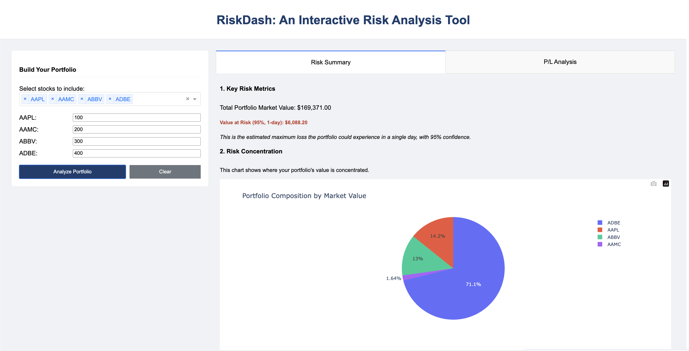

# RiskDash: My Journey into Interactive Risk Analysis

This project started as a personal challenge: I wanted to see if I could build a simple, hands-on prototype of a financial risk management system. I've always been fascinated by financial markets, and this was a great way to get my hands dirty with concepts like **Value at Risk (VaR)**.

The goal was to create an interactive web dashboard that could help me (and hopefully others!) visualize the market risk of a stock portfolio. It's one thing to read about VaR in a textbook, but it's another to build a tool that calculates it for you.

> **A quick note:** I built this with the help of an AI assistant. It was a cool experiment in human-AI collaboration, where I handled the high-level design and problem-solving, and the AI helped with some of the boilerplate code. For a deeper dive into the "why" behind some of my technical decisions, check out the [[DESIGN_CHOICES.md]] file.



## So, What Can It Do?

*   **Build a Portfolio on the Fly:** The dashboard lets you construct a portfolio by picking stocks and setting quantities.
*   **Calculate Value at Risk (VaR):** It crunches the numbers to figure out the 1-day 95% VaR using the Historical Simulation method. No more manual spreadsheet madness!
*   **See Your Risk Concentration:** A pie chart shows you where your money is, making it easy to spot if you're too heavily invested in one stock.
*   **Simulate Profit/Loss:** A density plot gives you a visual feel for the potential range of daily profit and loss.
*   **Solid Backend:** I used a Flask API with a PostgreSQL database and SQLAlchemy ORM to keep things clean and scalable.
*   **Tested Logic:** I wrote a bunch of `pytest` unit tests to make sure the backend calculations are solid.

## Getting Started

### What you'll need
*   Python 3.9+
*   A running PostgreSQL server (I used it because it's robust and free!)

### Let's get it running

1.  **Clone the repo:**
    ```bash
    git clone https://github.com/sephcodes66/Interactive_Trade_Risk_Dashboard.git
    cd Interactive_Trade_Risk_Dashboard
    ```

2.  **Set up a virtual environment (always a good idea!):**
    ```bash
    python3 -m venv .venv
    source .venv/bin/activate
    ```

3.  **Install the goodies:**
    ```bash
    pip install -r requirements.txt
    pip install -e .
    ```

4.  **Set up the database:**
    *   First, you'll need to create a new PostgreSQL database. I called mine `risk_dash_db`.
    *   Copy the `.env.example` file to `.env` and pop in your database credentials. This keeps your secrets safe!

5.  **Load the data:**
    This script sets up the tables and fills them with the sample data.
    ```bash
    python ingest_data.py
    ```

## How to Run It

### The Interactive Dashboard

To fire up the main web app, just run this from the project root:
```bash
python -m src.app
```
You should be able to see the dashboard at **http://127.0.0.1:8050/dash/**.

### Automated Report

I also built a little script to generate a sample risk report in Markdown.
```bash
python automate_report.py
```
This will create a file in the `reports/` directory (you might have to create the directory first if it's not there).

### Running Tests

To make sure everything is working as expected, run the tests:
```bash
pytest
```

## Future Ideas & Known Limitations

This is just a prototype, so there's a lot more that could be done!
*   **More Risk Models:** Add other VaR methods like Parametric or Monte Carlo simulation.
*   **User Accounts:** It would be cool to have user accounts to save portfolios.
*   **Live Data:** Right now, it uses historical data. Connecting to a live market data feed would be the next level.
*   **The data is a bit old:** The sample stock data is from a specific period and doesn't update.

Got any ideas? Feel free to open an issue or a PR!