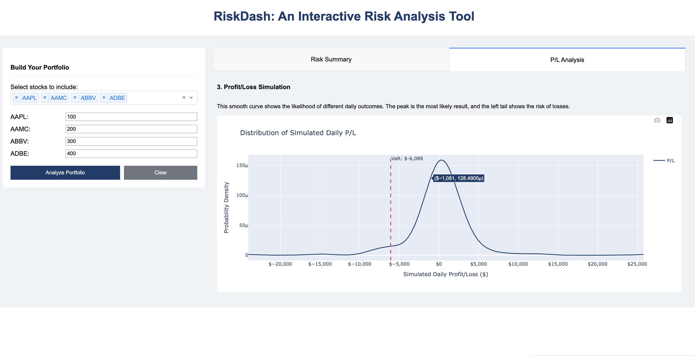

# RiskDash: An Interactive Risk Analysis Tool

RiskDash is a prototype of a financial risk management system. It provides an interactive web dashboard to help risk analysts and portfolio managers assess the market risk of equity portfolios using the industry-standard **Value at Risk (VaR)** metric.

The application is built with a modern Python stack, featuring a backend API powered by Flask and a frontend dashboard built with Plotly and Dash. The backend uses the SQLAlchemy ORM to interact with a PostgreSQL database, ensuring the code is maintainable and robust.




## Key Features

*   **Interactive Portfolio Builder:** Easily construct a portfolio by selecting multiple stocks from a searchable dropdown and specifying quantities.
*   **Value at Risk (VaR) Calculation:** The core of the application calculates the 1-day 95% VaR using the Historical Simulation method, providing a clear measure of potential downside risk.
*   **Risk Concentration Analysis:** A pie chart immediately shows the weight of each asset in the portfolio, making it easy to spot concentration risk.
*   **Profit/Loss Simulation:** A smoothed density plot visualizes the distribution of potential daily profit and loss outcomes, offering an intuitive look at the portfolio's volatility and risk profile.
*   **Robust Backend:** The application is built on a solid foundation with a Flask API, a PostgreSQL database, and the SQLAlchemy ORM for clean, maintainable data access.
*   **Fully Tested:** The entire backend is verified by a comprehensive suite of unit tests using `pytest`.

## Project Structure

The project is structured as an installable Python package.

```
.
├── automate_report.py    # Script to generate a daily risk report.
├── data/                   # Contains the raw stock and ETF data in CSV format.
├── ingest_data.py        # Script to load the CSV data into the PostgreSQL database.
├── requirements.txt      # A list of all Python packages required by the project.
├── setup.py              # Makes the project installable.
├── src/
│   ├── __init__.py       # Marks 'src' as a package and contains the DB connection logic.
│   ├── app.py            # Contains the main Dash application layout and callbacks, and the Flask API.
│   ├── models.py         # Defines the SQLAlchemy ORM models for the database tables.
│   ├── portfolio.py      # The PortfolioManager class, responsible for portfolio-related calculations.
│   └── risk_engine.py    # The RiskEngine class, which handles the core VaR calculation.
├── tests/
│   ├── test_api.py
│   ├── test_portfolio.py
│   └── test_risk_engine.py
├── .env.example          # Example environment file for database credentials.
├── BUSINESS_REQUIREMENTS.md # Outlines the high-level goals and scope of the project.
├── CHANGELOG.md          # A log of all notable changes, features, and bug fixes.
├── database_schema.md    # Documents the database schema and complex query designs.
└── TESTING.md            # Contains the User Acceptance Testing (UAT) plan and acceptance criteria.
```

## Setup and Installation

### Prerequisites
*   Python 3.9+
*   PostgreSQL server running

### Steps

1.  **Clone the repository:**
    ```bash
    git clone https://github.com/sephcodes66/Interactive_Trade_Risk_Dashboard.git
    cd Interactive_Trade_Risk_Dashboard
    ```

2.  **Create and activate a virtual environment:**
    ```bash
    python3 -m venv .venv
    source .venv/bin/activate
    ```

3.  **Install dependencies:**
    ```bash
    pip install -r requirements.txt
    ```

4.  **Install the project in editable mode:**
    This is a crucial step that makes the `src` package available to the scripts.
    ```bash
    pip install -e .
    ```

5.  **Set up the database:**
    *   Connect to your PostgreSQL server and create a new database (e.g., `risk_dash_db`).
    *   Create a `.env` file in the project root by copying the example: `cp .env.example .env`.
    *   Edit the `.env` file with your database credentials (user, password, host, port, and the database name).

6.  **Run the data ingestion script:**
    This will create the necessary tables and populate your database with the historical data. This may take a few minutes.
    ```bash
    python ingest_data.py
    ```

## How to Run

### Interactive Dashboard

To run the main web application, execute the following command from the project's root directory:

```bash
python -m src.app
```
The dashboard will be available at **http://127.0.0.1:8050/dash/**.

### Automated Report

To generate a daily risk report for a sample portfolio, run:
```bash
python automate_report.py
```
This will create a Markdown file in the `reports/` directory.

## Running Tests

To run the full suite of unit tests, use `pytest`:
```bash
pytest
```