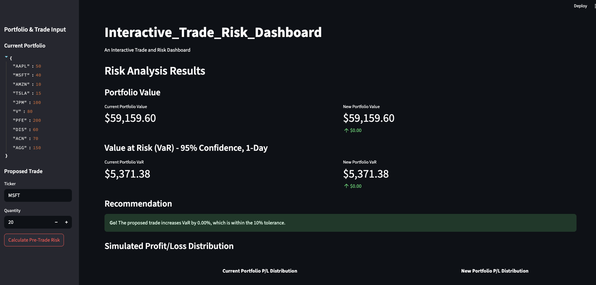
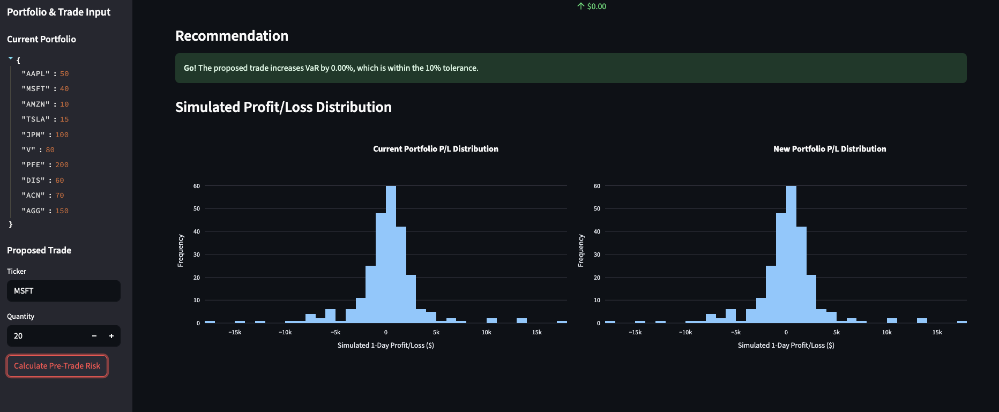

# Interactive_Trade_Risk_Dashboard

The `Interactive_Trade_Risk_Dashboard` is a functional prototype of a pre-trade risk analysis system. It is designed to provide traders and portfolio managers with a quick, interactive tool to assess the impact of a potential trade on their portfolio's overall risk profile, quantified by the financial metric **Value at Risk (VaR)**.

This project was built to demonstrate a full-stack data application, showcasing skills in Python, data engineering, backend development, financial modeling, and interactive data visualization.

## Table of Contents
- [The Core Problem: Pre-Trade Risk](#the-core-problem-pre-trade-risk)
- [The Solution: Value at Risk (VaR)](#the-solution-value-at-risk-var)
- [System Architecture](#system-architecture)
- [Features](#features)
- [Application Output](#application-output)
- [Setup and Installation](#setup-and-installation)
- [Running the Application](#running-the-application)
- [Code Quality: Linting and Testing](#code-quality-linting-and-testing)

## The Core Problem: Pre-Trade Risk

In financial markets, every trade carries risk. Before executing a new trade, a portfolio manager must ask a critical question: **"How will this trade affect my portfolio's overall risk?"** Adding a new position could either increase risk concentration, or it could potentially decrease it through diversification. Answering this question manually is slow and complex. This dashboard aims to solve this by providing an instant, data-driven answer.

## The Solution: Value at Risk (VaR)

To quantify this risk, we use **Value at Risk (VaR)**. VaR is a statistical measure that estimates the potential loss a portfolio could suffer over a specific time horizon, at a given confidence level.

For example, a 1-day 95% VaR of **$10,000** means that we are 95% confident that the portfolio will not lose more than $10,000 in the next trading day.

This project uses the **Historical Simulation Method** to calculate VaR. This method involves looking at how the current portfolio would have performed on each of the last *N* trading days (e.g., 252 days, or one trading year) to simulate a distribution of potential profits and losses. The VaR is then calculated from the 5th percentile of this distribution.

## System Architecture

The application is composed of four main components:

1.  **Data Ingestion Pipeline (`ingest_data.py`):** A script that sources historical stock and ETF price data from CSV files, processes it, and loads it into a structured PostgreSQL database.
2.  **PostgreSQL Database:** A relational database that stores the clean data in two main tables: `instruments` (for ticker information) and `market_data` (for daily price history).
3.  **Backend Risk Engine (`portfolio.py`, `risk_engine.py`):** The core Python logic.
    * `PortfolioManager`: A class to manage portfolio holdings and calculate their current market value.
    * `RiskEngine`: A class that fetches historical data from the database and implements the VaR calculation.
4.  **Interactive Frontend (`app.py`):** A web application built with **Streamlit** that provides a user interface for inputting trades, triggering the analysis, and visualizing the results in a clear and intuitive way.

## Features

* **Dynamic Data Ingestion:** Loads and processes over 150 different stock and ETF data files.
* **Robust Backend:** Object-oriented Python code for managing portfolios and calculating risk.
* **Historical VaR Calculation:** Implements the industry-standard historical simulation method for VaR.
* **Interactive UI:** Allows users to define a hypothetical trade and see its impact instantly.
* **Clear Go/No-Go Signal:** Provides a simple, color-coded recommendation based on whether the trade increases VaR beyond a set tolerance.
* **Rich Data Visualization:** Includes interactive histograms of the simulated Profit/Loss distributions for both the current and proposed portfolios.
* **Quality Assured:** The codebase includes a suite of unit tests (`pytest`) and is formatted with a linter (`ruff`).

## Application Output

When you run the application and click "Calculate", the main screen will display the following analysis:




* **Portfolio Value:** Metrics showing the current and new portfolio's total market value, with the change clearly indicated.
* **Value at Risk (VaR):** The core result. It displays the current and new VaR, highlighting the change. This is the primary indicator of the trade's impact on risk.
* **Recommendation:** A clear "Go" or "No-Go" message. The logic is based on whether the new VaR is lower than the current VaR, or if the increase is within a 10% tolerance.
* **Simulated P/L Distribution:** Two histograms that visually represent the risk. A wider distribution implies higher risk. You can visually compare the risk profiles of the portfolio before and after the proposed trade.

## Setup and Installation

### Prerequisites
* Python 3.9+
* PostgreSQL server running

### Steps
1.  **Clone the repository:**
    ```bash
    git clone <your-repo-url>
    cd Interactive_Trade_Risk_Dashboard # IMPORTANT: Ensure this matches your actual repository name after renaming
    ```

2.  **Create and activate a virtual environment:**
    ```bash
    python3 -m venv .venv
    source .venv/bin/activate
    ```

3.  **Install dependencies:**
    ```bash
    pip install -r requirements.txt
    ```

4.  **Install the project in editable mode (for testing):**
    ```bash
    pip install -e .
    ```

5.  **Set up the database:**
    * Connect to PostgreSQL and create a new database.
        ```sql
        CREATE DATABASE trade_risk_db; # Renamed from rita_risk_db1 for consistency
        ```
    * Create a `.env` file in the project root by copying the example:
        ```bash
        cp .env.example .env
        ```
        *(Note: You may need to create the `.env.example` file first if it doesn't exist)*
    * Edit the `.env` file with your database credentials (user, password, host, port, and the database name `trade_risk_db`).

6.  **Run the data ingestion script:**
    This will populate your database with the required historical data.
    ```bash
    python src/ingest_data.py
    ```

## Running the Application

To launch the interactive web application, run:
```bash
streamlit run src/app.py